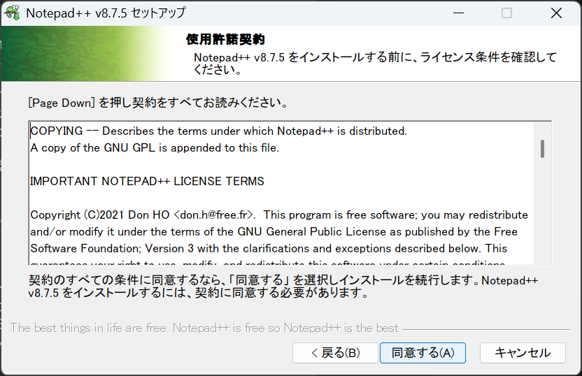

# C言語開発環境のセットアップ方法(Windows)


## 目次

- [エディタについて](#エディタについて)
- [コンパイラについて](#コンパイラについて)
- [MinGWのセットアップ方法](#mingwのセットアップ方法)
- [WSLのセットアップ方法](#wslのセットアップ方法)


## エディタについて
エディタ選びは宗教戦争に例えられるほど個人のこだわりが現れる部分です。
代表的なエディタとしてはVSCodeやEclipse、(Neo)Vim、Emacs等がありますが、ここでは阪大の環境に合わせてNotepad++のインストール方法を解説します。


1. Notepad++をダウンロードします。Notepad++は[こちら](https://notepad-plus-plus.org/downloads/)からダウンロードできます。


2. 一番新しいものか、(stable: auto-update triggered) と書いてあるものをクリックします。

   


3. **Download Notepad++ x64** と書いてある部分の下にある**Installer**をクリックします。

   


4. ダウンロードが終わったら、エクスプローラーでダウンロードフォルダを開きます。その中に先ほどダウンロードしたインストーラーが入っているはずなので、ダブルクリックして起動します。

   


5. 日本語が選択されていることを確認して、Okをクリックします。

   


6. 「次へ」をクリックします。

   


7. 「同意する」をクリックします。

   


8. 「次へ」をクリックします。

   


9. 「次へ」をクリックします。メニューなどを日本語で使いたい方は、この画面でLocalizationの左端にある+印を押し、下の方にスクロールしてJapaneseにチェックを入れてからクリックしてください。

   

   


10. 「インストール」をクリックします。デスクトップにNotepad++を起動するショートカットを追加したい方は、Create Shortcut on Desktopにチェックを入れてからクリックしてください。

    


11. 「完了」を押してください。Notepad++が起動します。

    


## コンパイラについて

Cのコンパイルにはgcc(GNU C Compiler)を使用します。gccはPOSIXというUnix系OSの規格を前提として作られていますが、WindowsはPOSIX互換ではないためそのままでは動作させることができません。

Windowsにおいてgccをセットアップする方法は主に[MinGWを使う方法](#mingwのセットアップ方法)と、WSLを使う方法があります。


### MinGWについて

MinGWはMinimalist GNU for Windowsの略であり、gccや関連ツール群をWindows環境で動くように移植したものです。阪大の環境ではこれが使用されています。セットアップが簡単なので、とりあえずこれを使っておけば間違いはありません。


ただし、MinGW本体はPOSIX互換レイヤーを提供しないため、デフォルトでは一部の機能が利用できないことがあります。恐らく授業で困ることはありませんが、個人でもプログラミングを楽しみたい場合や競技プログラミングをやりたい場合はWSLを使用することをお勧めします。


### WSLについて

WSLはWindows Subsystem for Linuxの略で、Windowsの機能としてLinux互換レイヤーを提供し、UbuntuなどのLinuxディストリビューションをそのまま動作させるための仕組みです。イメージとしては、PCの中に仮想的なPCが入っていて、その中でLinuxというOSが動いている感じです。


LinuxはPOSIX規格に準拠したOSであり、UNIX系の各種ツールやライブラリがほぼそのまま動作します。そのため、gccなどのコンパイラやmake、gdbといった開発ツール群をWindows上でもネイティブに利用でき、Windows特有のパスや改行コードの違いを意識せずに開発が行えます。


MinGWと違い、環境も汚れにくいので授業外でもプログラミングを楽しみたいならWSLを使う方法がおすすめです。


### オンラインコンパイラ

ちなみに、WEB上でC言語を実行することのできるサイトもあります。Googleで「online C compiler」などと検索すると出てきます。どうしてもコンパイラがセットアップできない場合は、Notepad++で書いたものをそこにコピペして実行してみるという手もあります。

その場合でも、必ずパソコンにファイルを保存するのを忘れないようにしてください。


## MinGWのセットアップ方法

自動セットアップスクリプトを用意しました。

以下のコマンドをコマンドプロンプトにコピペすると自動ですべての手順が実行されます。

```powershell
powershell -Command "$uri='https://github.com/oxonium0215/handai-C-setup-manual/raw/refs/heads/main/scripts/automingw.bat'; $tempFile=Join-Path $env:TEMP 'temp_script.bat'; Invoke-WebRequest -Uri $uri -OutFile $tempFile -ErrorAction Stop; try { $argList='/c \"'+$tempFile+'\"'; Start-Process cmd -ArgumentList $argList -Verb RunAs -Wait } finally { Remove-Item $tempFile -ErrorAction SilentlyContinue }" && exit
```

### 手動でのセットアップ

1. [MinGW-w64のGitHub](https://github.com/skeeto/w64devkit/releases)にアクセスし、w64devkit-x64-2.1.0.exeをクリックしてダウンロードする

   


2. こんな表示が出たら、ファイルの横のメニューをクリックし、保存を押す

   

   


3. 詳細を表示し、保持するをクリック

   


4. ダウンロードしたファイルを開いたら、Extract to:の下のテキストボックスの内容を`C:\`に変更する

   


5. 変更したら、Extractをクリック


6. Windowsの検索欄に「システム環境変数」と入力し、出てきたものをクリック

   


7. 環境変数をクリック

   


8. システム環境変数の方のPathをダブルクリック

   

> ## PATHとは？
>  
> **PATH** は「環境変数」の一つで、**コマンド実行時にプログラムを検索するためのディレクトリの一覧表**です。
> 通常は `C:\w64devkit\bin\gcc.exe` のように、実行ファイルのある場所（フルパス）を毎回指定しなければなりません。  
> しかし、`C:\w64devkit\bin` をPATHに登録しておくと、単に `gcc` と打つだけでシステムが自動的にそのフォルダ内を探して `gcc.exe` を起動してくれます。  
> もしPATHに含まれていなければ、コマンドプロンプト上で「`gcc` は内部コマンドまたは外部コマンド…」というエラーになります。

9. 新規をクリックし、`C:\w64devkit\bin`と入力してOKを押す

   


10. コマンドプロンプトを開いて、`gcc -v`と入力して情報が表示されれば成功

    


## WSLのセットアップ方法

準備中
VSCodeを使用する場合は、以下のサイトが参考になります。
https://zenn.dev/meiryo7743/articles/set-up-c-lang-env-in-vs-code-and-wsl2